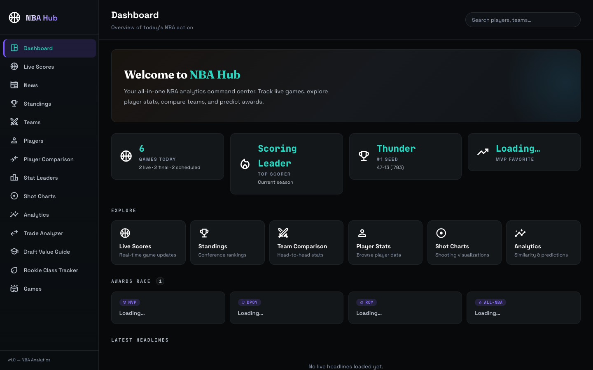
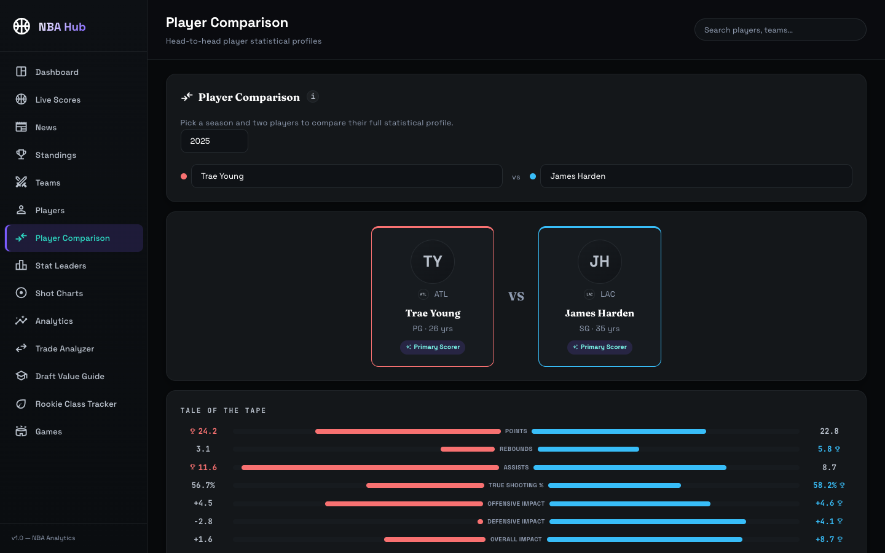
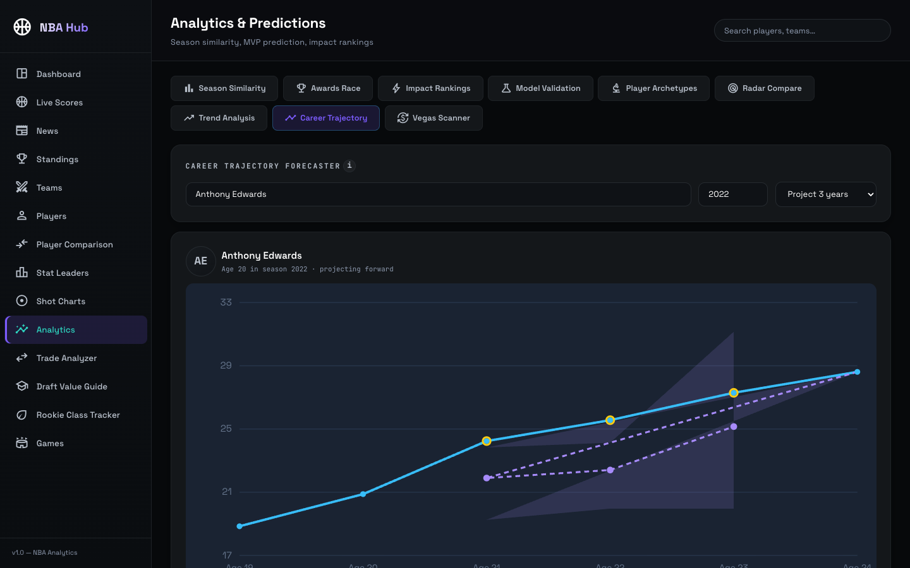
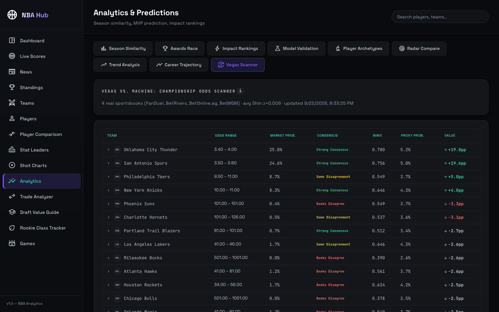
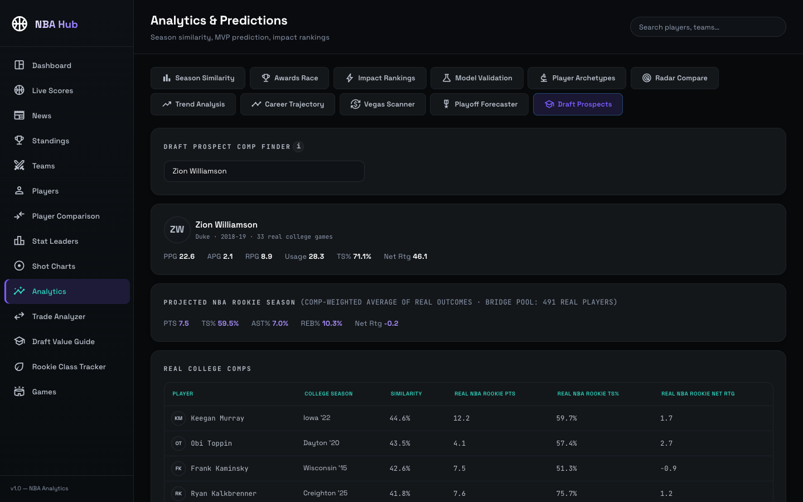
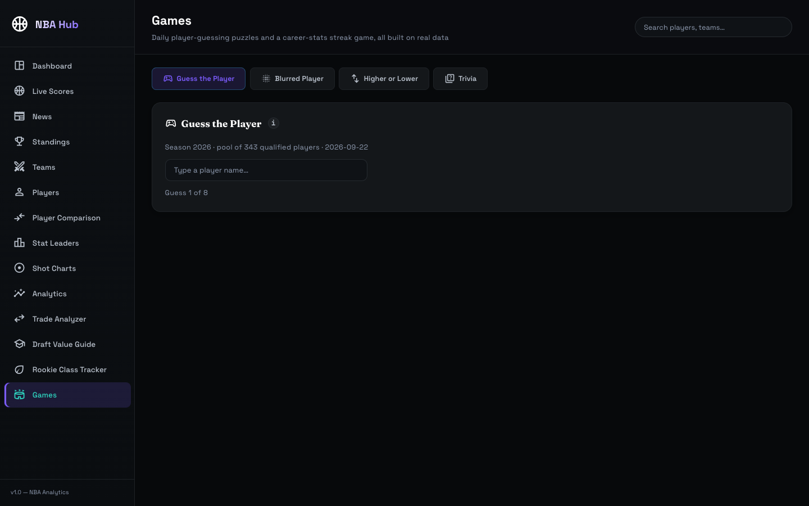

# NBA Hub

A full-stack NBA analytics platform built as a final-year project: real historical data (2009-10 through the current season), trained and backtested prediction models, era-normalized player comparison engines, a live betting-market cross-reference, real play-by-play win-probability modeling, and a suite of stat-driven daily games — all built on top of one PostgreSQL database and served through three FastAPI microservices to a React dashboard.

The project's guiding rule, followed throughout: **never fabricate data**. Where a real number exists, it's used and its source is traceable to a real endpoint or a real database column. Where the project doesn't have real data for something (player height/wingspan, a trade-history dataset, a real referee-bias claim), that gap is disclosed in the UI rather than invented — several features explicitly say what they *aren't*, and small real samples get an explicit warning instead of being presented as comprehensive.



---

## For an AI assistant picking this project up

Read this whole section before touching anything. It exists so you don't need the owner to re-explain context that's already been established over many previous sessions.

**Environment gotchas — get these wrong and everything else breaks:**
- Plain `python3` on this machine resolves to an Anaconda install missing this project's dependencies. Always use `/Library/Frameworks/Python.framework/Versions/3.14/bin/python3` explicitly, for every script run and every `pip install`.
- Each of the three API files has its own `if __name__ == "__main__"` uvicorn fallback port, but **always pass `--port` explicitly anyway** — don't rely on the fallback, and don't assume the fallback is correct (it has been wrong before and gets fixed reactively; the ports the frontend actually calls are the ones in `frontend/src/services/api.js` — currently 8000/mvp, 8001/similarity, 8002/impact).
- DB credentials live in `api/.env` (gitignored) as `DB_HOST`/`DB_PORT`/`DB_USER`/`DB_PASSWORD`/`DB_NAME`, read through `api/db_config.py` and `scripts/db_config.py` (two separate small modules, each resolving `api/.env` by an absolute path so they work regardless of current working directory). Every script and service does `from db_config import DB_CONFIG`. **Never hardcode the password back into a file** — it used to be hardcoded everywhere and was deliberately pulled out; the old password is still in git history from before that cleanup, so treat it as not-really-secret and don't reuse it for anything real.
- Postgres DB name: `nba_analytics`.
- Scripts are normally run as `cd scripts && python3 whatever.py` (their docstrings say so), but don't assume — check the top of the script; some things (like the test suite) are written to work from any cwd.
- `nba_api` hits the real stats.nba.com over the network. It's rate-limit-sensitive: existing fetch scripts use `time.sleep()` between calls (0.4–1.0s for reliable endpoints like `PlayByPlayV3`/`LeagueGameFinder`, more conservative 5–30s backoff for the flakier `shotchartdetail` endpoint) plus retry-with-backoff. Match the existing pattern in whichever script is closest to what you're building; don't invent a new rate-limiting scheme.
- Season encoding: `player_season_stats.season` and most other tables use the **end year as an int** (e.g. `2026` means the 2025-26 season). Convert to the NBA's own label format with `f"{season - 1}-{str(season)[-2:]}"` when calling `nba_api` — this exact expression appears throughout the codebase, copy it rather than reinventing it. **Known live discrepancy**: `pbp_games.season` is currently `2025` while `player_season_stats`'s max season is `2026` — the play-by-play sample was fetched from a season that was "current" at an earlier point in this project's history and hasn't been extended forward. Don't assume these two tables agree on "the latest season"; query each table's own `MAX(season)` rather than borrowing one table's latest-season logic for another table's endpoint (this exact bug was found and fixed once already in `/games/wp-replay/list`).

**The "never fabricate data" rule in practice — how to apply it to new work:**
- A composite/index metric (Heliocentricity Index, Impact Score) is fine as a simple, fully-disclosed equal-weighted average of real percentile ranks. It is never presented as a trained/validated model unless it actually is one.
- A predictive/simulated feature (e.g. "what would this trade do to team chemistry") needs either a real trained model with real validation metrics, or it gets scoped down to something that only uses real data that actually happened (see Lineup Chemistry below — the honest substitute for a "Trade Chemistry Simulator" that would have needed an invented usage-redistribution formula).
- Every "what if" / counterfactual feature (see Game Replay) must say in its own API response and its own UI copy that it's a counterfactual, not a prediction of what actually would have happened.
- Small real samples get a disclosed warning/cutoff (e.g. Playoff Drop-off Forecaster's `small_sample_warning` under 10 games, Lineup Chemistry's `min_minutes` cutoff with `lineups_qualified`/`lineups_total` both returned) rather than being silently included or silently hidden.
- If a feature needs data the project doesn't have (a real API key, a real dataset), say so to the owner directly and ask, rather than fabricating placeholder data or silently declining. Registering third-party accounts / submitting signup forms with the owner's info is an action that needs the owner's explicit go-ahead, not something to do autonomously.

**Verification discipline expected on every feature before it's considered done:**
1. Test the actual data source (nba_api endpoint, SQL query, whatever) directly with real inputs *before* writing application code around it — this has caught real bugs early several times (empty-string score fields that needed forward-filling, a `CalibratedClassifierCV` API quirk, non-unique `action_number` values).
2. Run the backend, `curl` the new endpoint(s), confirm real data and the expected JSON shape.
3. Start the frontend dev server, actually click through the new UI in the browser pane (`preview_start` with name `nba-frontend`), check the browser console for errors, screenshot if it's visual.
4. Run the smoke tests: `/Library/Frameworks/Python.framework/Versions/3.14/bin/python3 -m pytest api/tests` (works from repo root or `api/`). Add a test for any new endpoint.
5. Do a real "sniff test": does a leaderboard/ranking match genuine basketball knowledge? (e.g. DeMar DeRozan's real reputation as a clutch scorer landing near the top of the Clutch WPA leaderboard was treated as evidence the whole WPA pipeline was working.)
6. `git status --short` and a `grep` for any literal secret values across changed files, every time, before staging — `api/.env` must never get committed (it's gitignored; verify with `git check-ignore -v api/.env` if in doubt).

**Commit style:** one commit per feature, detailed message explaining what's real about it and what was verified, ending with `Co-Authored-By: Claude Sonnet 5 <noreply@anthropic.com>` (or whichever model actually did the work — check the current session's own attribution instructions rather than assuming). Only commit when the owner asks; `git status` and read the diff before staging.

**Current status as of this README's last update:** everything in "What's in it" below is built, verified, and pushed. The project is being extended feature-by-feature from a longer roadmap — see **Roadmap / what's next** near the bottom for the exact remaining list in priority order, including which items are already partly done and any scope notes discovered while building adjacent features (e.g. Lineup Chemistry already covers part of what a later "real lineups + on/off" item was going to build).

---

## What's in it

**Core stats & browsing**
- Live scores, standings, news, team comparison, full player-stats browser with sortable/filterable tables
- Shot charts (real shot-location data, live-fetched and cached per player/season)
- Stat leaders, Draft Value Guide (career value by draft slot), Rookie Class Tracker (this season's rookies ranked by real ROY probability)

**Player Comparison**
- Head-to-head statistical profiles with percentile ranks against a real qualified-player pool
- Fit Analysis: usage/spacing/role-overlap flags computed from real percentile thresholds — explicitly labeled as a simplified heuristic, not a trained synergy model



**Analytics** (grouped into four tab groups — Models, Player Analysis, Teams & Markets, Prospects — with the active tab kept in sync with the URL hash, e.g. `#wpa`, `#lineups`, `#replay`, so any tab is directly linkable)

*Models*
- Awards Race, Impact Rankings, Model Validation — ROC curves, SHAP feature breakdowns, leave-one-season-out backtests against real historical winners for MVP/DPOY/ROY/All-NBA, **plus a Clutch WPA calibration tab**: real Brier score, log loss, and a 10-bucket reliability curve (predicted probability vs. real observed outcome) for the win-probability model, computed on real held-out games and shown for both "all events" and "real clutch time only" scopes, with an explicit note that the two scopes' aggregate scores aren't directly comparable (clutch predictions cluster near 50/50, which is a harder problem, not worse calibration — the reliability points are the real evidence).
- **Prediction Ledger** — real live model predictions (MVP/DPOY/ROY/All-NBA) logged with a real timestamp (`scripts/snapshot_predictions.py`), graded with a real Brier score once a season actually finishes and gets a real recorded winner/selection (`scripts/resolve_predictions.py`). Shows each award's current real favorites' probability trajectory over real logged snapshots, kept strictly separate from the honest historical backtest tables above — this is a live, growing record of what the model actually said and when, not a re-run.

*Player Analysis*
- Season Similarity & Player Archetypes — cosine-similarity and K-Means clustering, both **era-normalized**: every feature is z-scored within its own season before comparison. Player Archetypes includes a **League Evolution** panel: a real stacked-area chart of each archetype's share of the qualified pool across all 17 seasons, plus minutes-weighted real league-average trend lines for 3PA rate, True Shooting %, and a disclosed real pace proxy — cleanly reproduces the real, well-documented 3-point revolution and pace revival as a sanity check.
- Radar Compare, Trend Analysis, Career Trajectory Forecaster (CARMELO-style: real closest-age comps, weighted by similarity, overlaid against real future data when it exists)



- **Heliocentricity Index** — real touch/possession-share data (`nba_api`'s `LeagueDashPtStats`) combined with real usage%/assist% into a disclosed, equal-weighted percentile-rank composite (modeled on the Impact Score's own precedent). Explicitly not a predictive "slider" — just an honest index of who the real offense actually runs through.
- **Clutch-Time Win Probability Added (WPA) Tracker** — a real trained Logistic Regression win-probability model (same library/approach as the MVP/DPOY/ROY models), fit on real play-by-play (`scripts/fetch_play_by_play.py` → `train_wpa_model.py` → `compute_wpa.py`), isotonic-calibrated, held out by *game* (not by row) to avoid leakage. WPA per play = the model's real win-probability output after the play minus before it, attributed to whichever player made the play, summed over the NBA's own real "clutch time" definition (final 5 min of regulation/OT, score within 5). The real sample size (games actually fetched, not implied to be the full season) is always shown.

*Teams & Markets*
- Vegas vs. Machine — real live championship-winner odds across multiple real sportsbooks, de-vigged with Shin's method, with per-book breakdown and a consensus-disagreement signal (coefficient of variation across books).



- Playoff Drop-off Forecaster — real regular-season vs. real playoff advanced stats for the same player-season, with a small-sample warning under 10 real playoff games.
- **Lineup Chemistry** — real 5-man lineup combinations that have actually shared the floor this season (`nba_api`'s `LeagueDashLineups`: real Off/Def/Net Rating, minutes, AST%, TS%), Best/Worst toggle, with a disclosed minimum-shared-minutes cutoff (`lineups_qualified` of `lineups_total` always shown) since tiny real samples produce real but extremely noisy net ratings. This is the honest substitute for a "Trade Chemistry Simulator" — instead of inventing a usage-redistribution formula for a lineup that's never played together, it shows how real lineups that *have* actually played together have actually performed.
- **Game Win-Probability Replay** — replays one real game's entire real play-by-play through the same real WPA model, charting home win probability over the whole game (top 5 real plays by |WPA| marked, hover for details), plus a clickable "what if this real missed shot had gone in" counterfactual (dashed line) that recomputes the rest of the game's win probability assuming the shot's points landed and every later real play happened exactly as it did — clearly labeled as a counterfactual, not a re-simulation.
- **With vs. Without a Star** — pick a real team, season, and player: real record, win%, and average point differential split by whether that real player actually played in each real game that season, live-fetched from the NBA's own full-season game logs. Labeled explicitly as a real association, not a causal claim (other absences in the same games aren't controlled for) — a real sniff test on the 2023-24 Sixers/Embiid split (79.5% win rate with him vs. 37.2% without, across 39 and 43 real games) reproduces that season's well-documented real storyline exactly.

*Prospects*
- Draft Prospect Comp Finder — ~105,000 real D1 college player-seasons (CollegeBasketballData.com), era-normalized, matched by name to real NBA rookie outcomes wherever a real match exists (~55% of NBA rookies since 2015 — international/G-League/draft-and-stash players never appear in US college data).



**Games** (daily, stateless, all built on the same real qualified-player pool)
- Guess the Player, Blurred Player (real headshot proxied through the backend so the URL can't just be read off the page), Higher or Lower, Trivia (5 daily questions, decoys always other real players)
- **Guess the Game** — a real completed game's real win-probability curve (from the same WPA model as Clutch WPA/Game Replay), no teams or date shown; up to 3 guesses at either team, each wrong guess revealing the next real clue (season → final margin → one team)



**Dashboard**
- Awards Race cards show real seed and "won it before" streak badges — informational context from real standings/award history, never folded into the model's own probability number

---

## Architecture

```
                       ┌─────────────────────┐
                       │   React / Vite SPA   │  localhost:5173
                       └──────────┬───────────┘
                                  │ axios
         ┌────────────────────────┼────────────────────────┐
         ▼                        ▼                        ▼
┌─────────────────┐    ┌──────────────────┐    ┌──────────────────┐
│   mvp_api.py     │    │ similarity_api.py│    │  impact_api.py    │
│  localhost:8000  │    │  localhost:8001  │    │  localhost:8002   │
│  awards models,  │    │  similarity,      │    │  everything else: │
│  backtests, SHAP,│    │  clustering,      │    │  games, dashboard,│
│  WPA calibration │    │  trajectory       │    │  odds, live data, │
│                  │    │                   │    │  WPA/lineups/replay│
└────────┬─────────┘    └────────┬──────────┘    └────────┬─────────┘
         └────────────────────────┼────────────────────────┘
                                  ▼
                     ┌─────────────────────────┐
                     │  PostgreSQL: nba_analytics│
                     └─────────────────────────┘
```

Each service is independent (its own CORS setup, its own DB connection pool built from the shared `db_config.py`) and can be restarted without touching the others. The frontend's `services/api.js` hardcodes which base URL each feature calls. `scripts/wpa_lib.py` is a small shared module (model loading, win-probability scoring, the clutch-time constants, a game-clock-elapsed conversion) imported by both `scripts/compute_wpa.py` and `api/impact_api.py`'s Game Replay endpoints, so there's exactly one real implementation of the win-probability math rather than two that could drift apart.

## Database schema (all tables in `nba_analytics`)

| Table | What it holds |
|---|---|
| `player_season_stats` | Core real per-player-season stat line, every season 2009-10–present |
| `all_nba_seasons`, `mvp_seasons`, `dpoy_seasons`, `roy_seasons`, `award_winners` | Real historical award ballots/winners |
| `model_backtest_summary`, `model_backtest_seasons`, `all_nba_backtest_summary`, `all_nba_backtest_seasons`, `win_model_backtest` | Leave-one-season-out backtest results (honest, historical — not live predictions) |
| `shap_explanations` | Cached SHAP breakdowns for the Random Forest award models |
| `season_similarity`, `career_similarity` | Precomputed cosine-similarity pairs |
| `player_clusters`, `cluster_archetypes` | K-Means archetype assignments and labels |
| `draft_history` | Real draft-pick outcomes |
| `defense_tracking_stats` | Real defensive tracking stats (DPOY features) |
| `player_shots`, `player_shots_cache_status`, `league_shot_zones` | Live-fetched, cached shot-location data |
| `college_player_season_stats` | ~105k real D1 college player-seasons (CollegeBasketballData.com) |
| `pbp_games`, `pbp_events` | Real play-by-play, sampled games (`fetch_play_by_play.py`) — **`pbp_games.season` currently lags `player_season_stats`'s latest season by one, see gotcha above** |
| `player_wpa_totals` | Aggregated real Win Probability Added per player (`compute_wpa.py` output) |
| `wpa_model_validation` | Real calibration validation (Brier/log-loss/reliability bins) for the WPA model, two scopes: all events and clutch-only |

## Tech stack

- **Backend:** Python, FastAPI, psycopg2, pandas, scikit-learn, scipy, `nba_api`, requests, python-dotenv, pytest + httpx (smoke tests)
- **Database:** PostgreSQL (`nba_analytics`)
- **Frontend:** React 19, Vite, Framer Motion, axios — no charting library; every chart (radar profiles, ROC curves, reliability diagrams, win-probability replay, trajectory cones, archetype scatter plots) is a hand-built SVG component
- **Models:** Logistic Regression (MVP/DPOY/ROY, ROC/SHAP-validated; win-probability model, isotonic-calibrated), K-Means clustering (archetypes), cosine similarity (season/career comps)

## Running it locally

### Prerequisites
- PostgreSQL running locally with a `nba_analytics` database already populated (see `scripts/` for the fetch/build pipeline)
- Node.js for the frontend

### Python interpreter — read this first
```bash
/Library/Frameworks/Python.framework/Versions/3.14/bin/python3 -m pip install fastapi uvicorn psycopg2-binary pandas numpy scikit-learn scipy nba_api requests python-dotenv pytest httpx certifi
```

### `.env` setup
Create `api/.env` (gitignored):
```bash
DB_HOST=localhost
DB_PORT=5432
DB_USER=postgres
DB_PASSWORD=your_local_postgres_password
DB_NAME=nba_analytics

# Optional — see "Optional live data" below
ODDS_API_KEY=your_odds_api_key_here
CBBD_API_KEY=your_cbbd_api_key_here
```

### Start the three backend services
Always pass `--port` explicitly:
```bash
cd api
/Library/Frameworks/Python.framework/Versions/3.14/bin/python3 -m uvicorn mvp_api:app        --port 8000 --reload
/Library/Frameworks/Python.framework/Versions/3.14/bin/python3 -m uvicorn similarity_api:app --port 8001 --reload
/Library/Frameworks/Python.framework/Versions/3.14/bin/python3 -m uvicorn impact_api:app     --port 8002 --reload
```

### Optional: live championship odds and college data
Two Analytics tabs need their own free API keys. Without them, every other feature still works — those two tabs just report the key is missing.
- **ODDS_API_KEY** (Vegas Scanner) — [The Odds API](https://the-odds-api.com/), free tier ~500 requests/month.
- **CBBD_API_KEY** (Draft Prospects) — [CollegeBasketballData.com](https://collegebasketballdata.com/key), free, one-field email signup. Only needed to re-run `scripts/fetch_college_stats.py`; the Draft Prospects tab itself just reads from Postgres once that script has run.

### Start the frontend
```bash
cd frontend
npm install
npm run dev
```
Opens at `http://localhost:5173`.

### Run the backend smoke tests
```bash
/Library/Frameworks/Python.framework/Versions/3.14/bin/python3 -m pytest api/tests -v
```
Real integration tests (FastAPI `TestClient` against the live local DB, no mocks) — skipped with a clear reason if Postgres isn't reachable. Add a test here for every new endpoint.

## Project structure

```
api/
  .env                  DB creds + API keys — gitignored, never committed
  db_config.py           Shared DB_CONFIG dict, read from api/.env
  mvp_api.py             Awards models, backtests, SHAP, WPA calibration (:8000)
  similarity_api.py      Similarity, clustering, trajectory (:8001)
  impact_api.py          Everything else — games, dashboard, odds, WPA/lineups/replay (:8002)
  shots_lib.py           Shared shot-chart fetch/cache logic
  tests/test_smoke.py    Real integration smoke tests, one per shipped endpoint
scripts/
  db_config.py           Shared DB_CONFIG dict for scripts/, resolves api/.env by absolute path
  wpa_lib.py              Shared WPA model loading/scoring, used by compute_wpa.py and impact_api.py
  fetch_*.py, build_*.py, train_*.py, compute_*.py, precompute_*.py, upgrade_*.py
                          The data pipeline: fetch from nba_api/CBBD → build/write Postgres tables →
                          train/backtest models → precompute derived tables. Each script's own
                          docstring says what real data it uses and how to run it.
  *.pkl                   Saved trained model artifacts (committed — matches project convention)
frontend/
  src/
    components/
      pages/              Top-level routed pages (Dashboard, Player Comparison, Games hub, ...)
      common/              Shared components (PlayerHeadshot, TeamLogo, InfoTooltip, Icon, ...)
      *.jsx                Analytics sub-tab components (one per feature)
      pages/AnalyticsSection.jsx   Tab-group registry — add new Analytics tabs here (TAB_GROUPS array)
    services/api.js        Every backend call, one file, grouped by feature, one fetch function each
    styles/dashboard.css   Single stylesheet for the whole app
docs/screenshots/          README images (not all newer features have one yet)
PROJECT_DETAILS.md         Deep-dive on the ML methodology (predates several features in this README —
                          the modeling-methodology sections are still accurate; treat the feature list
                          in THIS file as the current source of truth)
```

## Established conventions & patterns (follow these, don't reinvent)

- **Era-normalization**: any feature comparing players across seasons z-scores each stat within its own season's qualified pool first (`cluster_players.py`, the similarity engines, the Draft Prospect bridge pool). Never pool raw stat values across eras.
- **Headshots/logos**: `<PlayerHeadshot playerId={} playerName={} size={} />` and `<TeamLogo abbreviation={} size={} />` (both in `components/common/`) — they fail gracefully to initials/a fallback, never a broken image icon.
- **Tooltips**: `<InfoTooltip label="..." title="...">` for any "how does this work" disclosure — the project's standard place to put honest methodology explanations rather than burying them in a modal or leaving them unexplained.
- **Analytics tabs**: registered in `TAB_GROUPS` in `frontend/src/components/pages/AnalyticsSection.jsx`, grouped into Models / Player Analysis / Teams & Markets / Prospects. The active tab syncs to `location.hash` via `history.replaceState` (no back-button spam) so any tab is directly linkable, e.g. `http://localhost:5173/#wpa`.
- **Live external fetches** in the API layer are cached in an in-process `_CACHE` dict with a TTL (see `impact_api.py`'s `_CACHE`/`_CACHE_TTL_SECONDS`) rather than hitting `nba_api`/external APIs on every request.
- **New feature checklist**: pipeline script in `scripts/` (if new data needed) → Postgres table → endpoint in the right API file (awards/validation → `mvp_api.py`; similarity/clustering → `similarity_api.py`; everything else → `impact_api.py`) → `fetchXyz()` function in `services/api.js` → `XyzSection.jsx` component → registered in `AnalyticsSection.jsx`'s `TAB_GROUPS` → smoke test → verified in browser → committed.

## Known real gaps (disclosed, not hidden)

- No real player height/weight/wingspan/draft-combine data anywhere in the pipeline yet (planned: `nba_api`'s `DraftCombineStats`, not yet built) — features that would want it (Fit Analysis, archetypes) use statistical "archetype" clustering as a disclosed stand-in for a scouted role instead.
- No real trade-transaction-history dataset exists for a genuine "Trade Chemistry Simulator" — Lineup Chemistry is the honest, real-data substitute (see above); a true trade simulator remains blocked on data, not effort.
- No real MVP/DPOY/ROY betting-futures market exists on the odds provider used here — checked directly against the live API before building the Vegas Scanner, which is why that feature compares championship odds instead.
- The odds API free tier is quota-limited (~500 req/month); the scanner caches live odds for 6 hours rather than fetching on every page load.
- The WPA model is trained on a real sample of games (currently ~420, not the full ~1230-game season) — always disclosed via `sample_size_games`/`n_games_train`/`n_games_test` in the relevant API responses rather than implied to be comprehensive.
- `pbp_games.season` (2025) currently lags `player_season_stats`'s latest season (2026) by one — see the environment-gotchas section above.
- Live `nba_api`/`stats.nba.com` calls are occasionally flaky (shot-chart data, live player search) — external network reliability, handled with retries/backoff, not a code bug.

## Roadmap / what's next

This project is being built from a longer plan, executed feature-by-feature with full verification each time. Everything above is done, verified, and pushed. In priority order, what's left (originally scoped by a planning session, adjusted where building earlier items changed the scope of later ones):

1. **C1 — Draft Combine measurements**: `nba_api`'s `DraftCombineStats`, one call per season back to ~2000. Feeds an optional "include measurements" toggle in Draft Prospect Comp Finder, a "does length matter?" real-correlation study card, and body measurements in the Player Comparison profile when available.
2. **C2 — On/off splits + pair-synergy model** (narrowed scope — Lineup Chemistry already covers the "real 5-man lineups" half): add `TeamPlayerOnOffDetails` (real per-player on/off net rating) and a ridge-regression pair-synergy model (predicting a real pair's net rating above the minutes-weighted average of their individual on-court net ratings, from archetype + z-scored usage/3PA/AST%/REB%/DBPM features, validated with season-grouped cross-validation, R² reported honestly even if low). Surfaces in Player Comparison's Fit Analysis as a real-data upgrade path alongside the existing heuristic (kept as a labeled fallback).
3. **C5 — Schedule fatigue**: rest days, back-to-backs, travel miles (haversine, from a small hardcoded real arena lat/lon table), time zones crossed, from `LeagueGameFinder` team game logs. Real net-rating-by-rest-bucket study, team schedule-difficulty ranking, "rest disadvantage" tags on today's Live Scores.
4. **C3 — Play-type and hustle profiles**: `nba_api`'s `SynergyPlayTypes` and `LeagueHustleStatsPlayer`. Play-type bar chart in player detail/Radar Compare, an "Offensive Style" K-Means clustering (same era-normalized pattern as the existing archetypes) alongside the stat-based archetypes, hustle leaders in Stat Leaders.
5. **C4 — Matchups / "Kryptonite" defender finder**: `nba_api`'s `LeagueSeasonMatchups` (partial possessions, points, FG% by defender). Needs real sample-size guardrails (grey out small samples) — a scorer's real toughest/easiest real matchups, reversible to "who does this defender shut down."
6. **C8 — Full-season play-by-play via hoopR/sportsdataverse, then retrain WPA on it**: bigger infra lift — real ESPN↔NBA ID mapping discipline needed (team abbreviation fixes, name-matching reusing the Draft Prospects bridge-pool approach, a `source` column so nba_api-sourced and hoopR-sourced rows never silently mix). Do this once the cheaper wins above are shipped, not before — nothing else in this list actually depends on it (verified: Game Replay, Guess the Game, and the WPA calibration tab all work fine on the current ~420-game sample).
7. **C6 — Referee tendencies**: `BoxScoreSummaryV2` officials, one API call per real game (slow — resume-if-interrupted, skip-already-fetched). Real fouls/FTA/pace-vs-league-average table with a 95% CI or small-n warning, strictly neutral wording, no bias claims. Check in with the owner before investing the time here given the sensitivity of the topic for a public repo.
8. **A2 — Source badges**: a small `_source` object (tables used, upstream API, timestamp if available) on the main analytics endpoints' JSON, surfaced as a `SourceBadge` chip in each section. Cross-cutting — best done as one sweep once most endpoints already exist, not incrementally.
9. **B5 — Ask the Database in plain English** (optional, costs Anthropic API spend, needs owner buy-in first): natural-language question → LLM-generated single read-only `SELECT` → real safety checks (reject anything but `SELECT`/`WITH...SELECT`, read-only transaction, statement timeout, row limit, ideally a dedicated read-only Postgres role) → results table shown alongside the exact SQL that ran, so the answer is verifiably real.
10. **A6 — Split `impact_api.py` into routers** (optional, do last): the file is large (4000+ lines). Pure refactor, no user-facing value, real risk to a working file — only worth doing if there's spare time, and verify against the smoke tests afterward since paths must stay identical.

**Just shipped:** C7 — With vs. Without a Star (real live team/player game-log split, Teams & Markets group) — see "What's in it" above.

**Operational note on the Prediction Ledger:** `snapshot_predictions.py` only logs a real point-in-time snapshot when it's actually run — nothing runs it automatically. Run it daily or weekly (manually, or via a cron/launchd entry you set up yourself; see the script's own docstring for an example cron line — nothing is auto-installed) so real trajectory history builds up over the season, and run `resolve_predictions.py` periodically to grade any season that's actually finished.

Throughout: update this README's "What's in it" and "Known real gaps" sections as each item ships, add a smoke test alongside each new endpoint rather than batching test-writing to the end, and keep screenshots reasonably current (not strictly required for every feature, but nice to have for the ones with real visual payoff).
